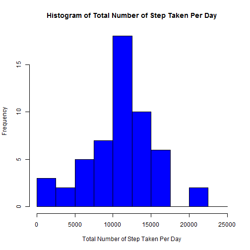
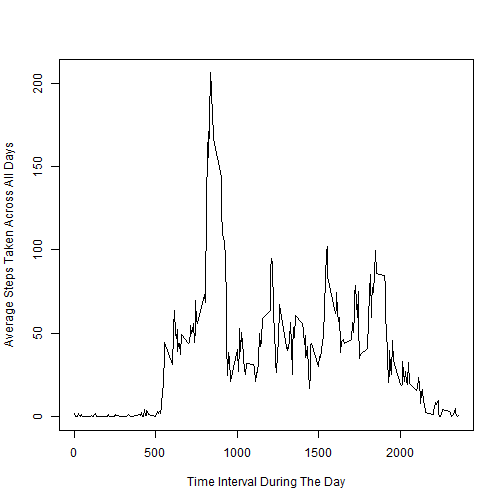
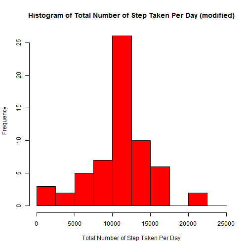
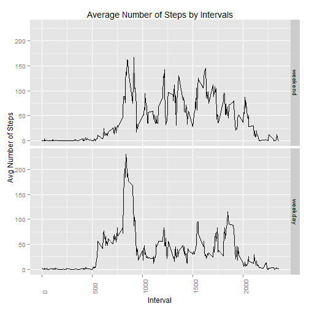

<br><br>

You need to install "reshape2" and "ggplot2" packages to run this code.
<br>

###Part 1 : Loading and preprocessing the data

- Read in csv file as data frame.  
- Format the "date" field to be of class date.  
- Preview the data frame (DF).   


```r
DF <- read.csv("activity.csv")
DF$date <- as.Date(DF$date)
head(DF)
```

```
##   steps       date interval
## 1    NA 2012-10-01        0
## 2    NA 2012-10-01        5
## 3    NA 2012-10-01       10
## 4    NA 2012-10-01       15
## 5    NA 2012-10-01       20
## 6    NA 2012-10-01       25
```

*Observation : The "steps" of the first few rows are coded as "NA".*  
<br><br>

###Part 2 : What is mean total number of steps taken per day?
<br>

**Cleaning of data**  

- Omit missing values in the dataset (DF1).   
- Create new data frame (sum_DF1) showing the total number of steps for each day.    
- Omit any missing value in new data frame (sum_DF1)  
         

```r
DF1 <- DF[complete.cases(DF),]
sum_DF1 <- data.frame(table(DF1$date))[,1]
sum_DF1 <- data.frame(sum_DF1, tapply(DF1$steps, DF1$date, sum))
colnames(sum_DF1) <- c("date", "steps")
```
<br>

**1. Make a histogram of the total number of steps taken each day.**    

- First, find the range in order to determine the breaks in the histogram.  
- Next, use the breaks to plot the histogram.  


```r
range(sum_DF1$steps)
```

```
## [1]    41 21194
```

```r
breaks = seq(0, 25000, by=2500)
hist(sum_DF1$steps, breaks = breaks, col = "blue", main = "Histogram of Total Number of Step Taken Per Day", xlab="Total Number of Step Taken Per Day")
```

 
<br>

**2. Calculate and report the mean and median total number of steps taken per day.**  


```r
mean1 <- mean(sum_DF1$steps)
paste("The mean total number of steps taken per day = ", mean1)
```

```
## [1] "The mean total number of steps taken per day =  10766.1886792453"
```

```r
median1 <- median(sum_DF1$steps)
paste("The median total number of steps taken per day = ", median1)
```

```
## [1] "The median total number of steps taken per day =  10765"
```
<br><br>

###Part 3 : What is the average daily activity pattern?  
<br>

**1. Make a time series plot of the 5-min interval (x-axis) and the average number of steps taken, averaged across all days (y-axis)**  

- create a new data frame (avg_DF1) to find the average number of steps for each interval  
- then produce the time series plot


```r
avg_DF1 <- data.frame(tapply(DF1$interval, DF1$interval, mean), tapply(DF1$steps, DF1$interval, mean))
colnames(avg_DF1) <- c("interval", "avg_steps")
plot(avg_DF1$interval, avg_DF1$avg_steps, type = "l", xlab = "Time Interval During The Day", ylab = "Average Steps Taken Across All Days")
```

 
<br>

**2. Which 5-minute interval, on average across all the days in the dataset, contains the maximum number of steps?**  

- subset data frame to get the row which has the maximum average number of steps  
- then look up for the interval value of the selected row  


```r
max_y <- max(avg_DF1$avg_steps)
max_x <- avg_DF1[avg_DF1$avg_steps == max_y,][,1]
paste("The 5-minute interval which contains the maximum number of steps is ", max_x)
```

```
## [1] "The 5-minute interval which contains the maximum number of steps is  835"
```
<br><br>

###Part 4 : Imputing missing values
<br>

**Note :**  

- There are a number of days/intervals where there are missing values (coded as NA).    
- These missing values may introduce bias into the calculations/summaries of the data.  
<br>

**1. Calculate and report the total number of missing values in the dataset**  

- use the original data frame from Part 1  
- subset the rows where the steps are coded as NAs  


```r
bad <- is.na(DF)
paste("The total number of missing values in the dataset = ", sum(bad))
```

```
## [1] "The total number of missing values in the dataset =  2304"
```
<br>

**2. Devise a strategy for filling in all of the missing values in the dataset**    

- Strategy adopted : **Replace** the **missing values** with the **mean for the corresponding 5-minute interval.**  
<br>

**3. Create a new dataset that is equal to the original dataset but with the missing data filled in.**  

- copy the original data frame from Part 1 (DF) to a new data frame (DF2)  
- if "step" in DF2 has a missing value, then take note of the time interval at which it occurred.  
- replace the missing value with the average number of steps for the corresponding time interval found in avg_DF1 of Part 3  
- preview the modified data frame (DF2)  


```r
DF2 <- DF
for (i in 1:nrow(DF)) {
  if (is.na(DF2$steps[i]) == T) {
       selected_interval <- DF2$interval[i] 
       DF2$steps[i] <- avg_DF1[avg_DF1[,1] == selected_interval,2]
  }
}
head(DF2)
```

```
##       steps       date interval
## 1 1.7169811 2012-10-01        0
## 2 0.3396226 2012-10-01        5
## 3 0.1320755 2012-10-01       10
## 4 0.1509434 2012-10-01       15
## 5 0.0754717 2012-10-01       20
## 6 2.0943396 2012-10-01       25
```

*Observation : The "steps" of the first few rows are no longer coded as "NA", but are replaced by the average number of the steps for the corresponding time interval.*  
<br>

**4. Make a histogram of the total number of steps taken each day.**   

- Create new data frame (sum_DF2) showing the total number of steps for each day.    
- Plot the histogram  


```r
sum_DF2 <- data.frame(table(DF2$date))[,1]
sum_DF2 <- data.frame(sum_DF2, tapply(DF2$steps, DF2$date, sum))
colnames(sum_DF2) <- c("date", "steps")

breaks = seq(0, 25000, by=2500)
hist(sum_DF2$steps, breaks = breaks, col = "red", main = "Histogram of Total Number of Step Taken Per Day (modified)", xlab="Total Number of Step Taken Per Day")
```

 
<br>

**Calculate and report the mean and median total number of steps taken per day.**  


```r
mean2 <- mean(sum_DF2$steps)
paste("The mean total number of steps taken per day (modified) = ", mean2)
```

```
## [1] "The mean total number of steps taken per day (modified) =  10766.1886792453"
```

```r
median2 <- median(sum_DF2$steps)
paste("The median total number of steps taken per day (modified) = ", median2)
```

```
## [1] "The median total number of steps taken per day (modified) =  10766.1886792453"
```
<br>

**Do these values differ from the estimates from the first part of the assignment?**  


```r
col1 <- c(mean1, median1, mean1-median1)
col2 <- c(mean2, median2, mean2-median2)
col3 <- list(mean2-mean1, median2-median1, "-")
compare_table <- as.data.frame(cbind(col1, col2, col3))
colnames(compare_table) <- c("Unmodified", "Modified", "Difference")
rownames(compare_table) <- c("Mean","Median","Difference")
compare_table
```

```
##            Unmodified Modified Difference
## Mean         10766.19 10766.19          0
## Median          10765 10766.19   1.188679
## Difference   1.188679        0          -
```

*Observation : Compared to the first part of the assignment, the mean remains the same, but the median has shifted a little to the right.*   
<br>

**What is the impact of imputing missing data on the estimates of the total daily number of steps?**  

*Observation : By imputing missing data, it reduces the bias in the calculations of summary statistics. The median and now exactly equal mean.*  
<br><br>

###Part 5 : Are there differences in activity patterns between weekdays & weekends?  
<br>

**Note : The dataset, DF2, with the filled-in missing values is used for this part.**  
<br>

**1. Create a new factor variable in the dataset with two levels - "weekday" and "weekend" indicating whether a given date is a weekday or weekend day.**     

- create a new variable (day_of_wk) to indicate the day of the week for each record in DF2  
- segregate the data into 2 sets : DF2_wkday for "weekday" and DF2_wkend for "weekend"  
- For each subset, create 2 new data frames (avg_DF2_wkday and avg_DF2_wkend) to do the following :  
-- find the average number of steps taken, averaged across all days, for each 5-min interval; and  
-- tag a new variable (wkday_wkend) to indicate if the record is for "weekday"" or "weekend"   
- then row bind the two subsets into one set (avg_DF2)  
- preview avg_DF2  


```r
DF2$day_of_wk <- weekdays(DF2$date)

DF2_wkend <- DF2[DF2$day_of_wk == "Saturday" | DF2$day_of_wk == "Sunday",] 
DF2_wkday <- DF2[!(DF2$day_of_wk == "Saturday" | DF2$day_of_wk == "Sunday"),]

avg_DF2_wkend <- data.frame("weekend", tapply(DF2_wkend$interval, DF2_wkend$interval, mean), tapply(DF2_wkend$steps, DF2_wkend$interval, mean))
colnames(avg_DF2_wkend) <- c("wkday_wkend", "interval", "avg_steps")

avg_DF2_wkday <- data.frame("weekday", tapply(DF2_wkday$interval, DF2_wkday$interval, mean), tapply(DF2_wkday$steps, DF2_wkday$interval, mean))
colnames(avg_DF2_wkday) <- c("wkday_wkend", "interval", "avg_steps")

avg_DF2 <- rbind(avg_DF2_wkend, avg_DF2_wkday)

head(avg_DF2)
```

```
##    wkday_wkend interval   avg_steps
## 0      weekend        0 0.214622642
## 5      weekend        5 0.042452830
## 10     weekend       10 0.016509434
## 15     weekend       15 0.018867925
## 20     weekend       20 0.009433962
## 25     weekend       25 3.511792453
```

*Observation : The new data frame has the 5-min intervals, the average number of steps for each interval, and a factor variable with 2 levels "weekday" or "weekend".*  
<br>

**2. Make a panel plot containing a time series plot (i.e. type = "l") of the 5-minute interval (x-axis) and the average number of steps taken, averaged across all weekday days or weekend days (y-axis).**  
<br>

**Produce a ggplot plot**  
- plot the average number of steps against each 5-min interval, facetted by weekday/weekend.


```r
library(ggplot2)
  g <- ggplot(avg_DF2, aes(interval, avg_steps)) 
  g <- g + geom_line()
  g <- g + facet_grid(wkday_wkend~.)
  g <- g + labs(title = "Average Number of Steps by Intervals")
  g <- g + labs(x = "Interval")
  g <- g + labs(y = "Avg Number of Steps")
  g <- g + theme(axis.text.x = element_text(angle=+90, hjust=0, vjust=1))  
  print(g)
```

 
